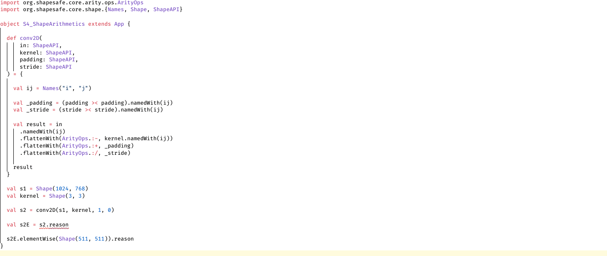
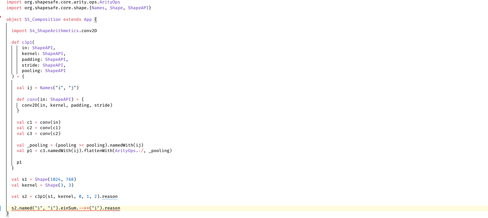

# ∀ Linear Algebra ∃ Proof System between Types

**shapesafe** is the missing compile-time verifier for numerical linear algebra on JVM, obvious shape and indexing errors in tensor operations are captured by scala's typing system.

shapesafe actively proves itself while being written. The following capabilities are introduced at inception:

- static & runtime-dependent tensor shapes of arbitrary rank

- named tensor: each dimension is indexed by both its name and ordinal number

- tensor contractions & operations that depends on index equality, (all cases of EinSum, dot/cross/matrix/hadamard product)

- operations that depends on shape arithmetics (convolution, direct sum, kronecker product, flatten/reshape)

- complex function composition, with no implicit scope

**It is not a tensor computing library!** Instead, it is designed to augment existing libraries for less error-prone prototyping (see Roadmap for possible augmentations).

shapesafe started as an assignment to understand intuitionistic type theory used in compiler design, it minimally depends on [singleton-ops](https://github.com/fthomas/singleton-ops) and [shapeless](https://github.com/milessabin/shapeless).

Support for scala-2.13 is always guaranteed, supports for scala-2.12 & scala-js will only be enforced intermittently and upon request, please create (or vote for) tickets to backport for a specific major version.

### Build Status

| branch \ profile | scala-2.12 | scala-2.13
|---|---|---|
| master |  |  |
| (latest in-progress) |  |  |

### Roadmap

##### High priority

- DJL integration

##### Low priority

- DL4j & ND4j integration
- breeze integration (only tensors to up to rank-2 is required)

### How to compile

In POSIX shell, run `./dev/make-all.sh`

Guaranteed to be working by [Continuous Integration](.github/workflows/main.yml)

[comment]: <> (### Architecture)

[comment]: <> (Contrary to many of its predecessors, all type-level operations in shapesafe are lazy, and invoking them requires no implicit arguments. This is a deliberate design which allows complex compositions to be defined with little boilerplate.)

##### Upgrade to Scala 3

Most features in shapeless & singleton-ops are taken over by native compiler features:

- shapeless.Witness ==> singleton type
- shapeless.Poly ==> polymorphic function
- singleton.ops.== ==> inline conditions & matches
- singleton.ops._ ==> scala.compiletime.ops.*
- shapeless.HList ==> Tuple

... but some are still missing:

- extensible & contractible Record type
  - shapeless.record => ???
  - used to derive output of EinSum & tensor contraction
  - proposed a long time ago: https://github.com/lampepfl/dotty-feature-requests/issues/8, but contraction is still problematic
- Product to Tuple conversion, plus its variants:
  - shapeless.NatProductArgs
  - shapeless.SingletonProductArgs
- ecosystem: Apache Spark, CHISEL, the typelevel cohort, and much more

### Credit

- [Prof. Dmytro Mitin](https://www.researchgate.net/profile/Dmytro-Mitin) at National Taras Shevchenko University of Kyiv
- All maintainers of [singleton-ops](https://github.com/fthomas/singleton-ops)
- All maintainers of [shapeless](https://github.com/milessabin/shapeless)
- All maintainers of [splain](https://github.com/tek/splain)
- Breandan Considine, lead committer of [Kotlin∇](https://openreview.net/forum?id=SkluMSZ08H)
